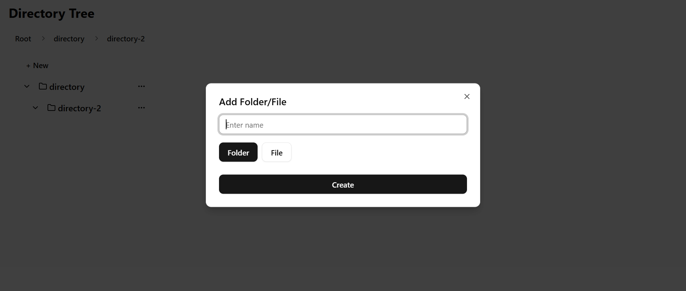

# Directory tree

A file management tree system built with Go, React, and PostgreSQL. It supports nested folder structures, file/folder creation, and deletion designed for speed, and simplicity.

---

## Live Demo



---

## Docker Setup

<!-- ### Option 1 (Quick)

Run the entire project instantly using Docker. You don't really need PostgreSQL installed on your machine because it runs in a container.

##### Requirements

- [Docker](https://www.docker.com/products/docker-desktop)
- [Docker Compose](https://docs.docker.com/compose/)

#### Step 1: Pull the Compose File

```bash
curl -O https://raw.githubusercontent.com/eofoneta/kosherhire-test/main/docker-compose.yml
# Step 2: Start Everything
docker compose up -d
```

This will pull and run the full stack.

Open frontend in Your Browser

Frontend: http://localhost:3000
Backend: http://localhost:8081 -->

<!-- ### Option 2 -->

### Prerequisites

- Docker & Docker Compose installed
- Postgresql (optional)
- `.env` file already exists at `backend/.env`  
  (Make sure it contains your `DATABASE_URL` see ./backend/.env.example for reference)

### Step-by-Step (run all at project root)

```bash
# 1. Clone the repository
git clone https://github.com/eofoneta/kosherhire-test.git
cd kosherhire-test

# 2. Run the app using docker compose
docker compose up -d
```

### Open in browser

Frontend: http://localhost:3000

## Run Locally (Development)

### Prerequisites

- Docker & Docker Compose installed
- Postgresql
- Go
- Node js/npm
- .env file already exists at backend/.env
  (Make sure it contains your DATABASE_URL)

```bash
git clone https://github.com/eofoneta/kosherhire-test.git

cd kosherhire

#Start backend
cd backend
go run main.go

#Start frontend
cd ..

cd frontend
npm run dev

# go back to root and run this

docker compose up --build
```

This will build the backend and frontend images from the code and run everything locally with a fresh PostgreSQL database.

#### folder structure

```
kosherhire-test/
├── backend/       # Go backend code (API)
├── frontend/      # React + Vite frontend
├── docker-compose.yml
└── README.md
```
